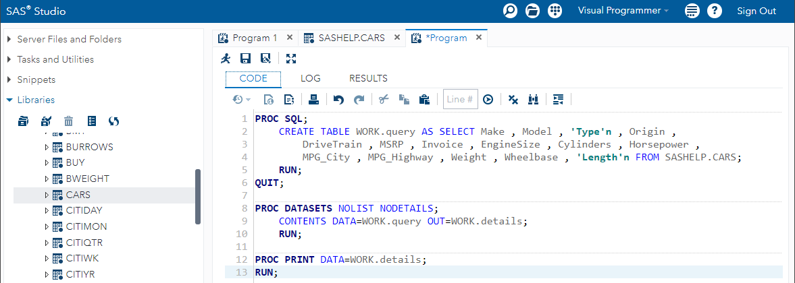

# Partons à la découverte de SAS !

**Objectifs du projet :**
 1. Technologie SAS : définitions et perspectives
 2. Découverte de la programmation SAS via SAS Studio
 3. Mise en oeuvre d'un cas d'utilisation

## Qu'est-ce que SAS ?

SAS - acronyme de Statistical Analysis System - est une suite logicielle statistique pour la gestion des données, l'analyse avancée, l'analyse multivariée, l'informatique décisionnelle et l'analyse prédictive.

## Interface graphique de SAS Studio

*Exemple de code auto-généré en language SAS pour l'import de données (ici un dataset fourni en exemple dans les bibliothèques de SAS Studio)*

## SAS Studio en quelques mots

SAS Studio fournit un environnement de développement pour écrire du code SAS, une interface graphique pour créer et modifier des données et des analyses, et des fonctionnalités de collaboration pour partager des projets avec d'autres utilisateurs. Il permet également d'accéder à des fichiers locaux ou distants, de se connecter à des serveurs SAS et de travailler avec des données en temps réel.

SAS Studio offre des fonctionnalités de pointe pour la programmation SAS, y compris la coloration syntaxique, la complétion automatique, le débogage et la vérification du code. Il est également livré avec une grande bibliothèque de tâches préprogrammées, de rapports et de graphiques qui peuvent être facilement personnalisés pour répondre aux besoins spécifiques de l'utilisateur.

SAS Studio est souvent utilisé dans les environnements d'entreprise, d'éducation et de recherche où l'accès à SAS est essentiel pour mener des analyses de données avancées. C'est une solution pratique et économique pour les utilisateurs qui ne peuvent pas ou ne veulent pas installer SAS sur leur propre ordinateur. Mais la courbe d'apprentissage de SAS (particulièrement de son language) est souvent considérée comme plus abrupte que celle de langages de programmation modernes tels que Python et R.

## SAS est-il mort ? Un point de vue...

Il s'agit ici d'évaluer la pertinence de SAS dans le paysage actuel de l'analyse de données, et plus récemment de la Data Science. L'exposé ci-dessous est la synthèse de mon expérience des outils utilisés en entreprise et d'une veille effectuée sur l'offre de service de SAS en 2023.

L'évolution rapide du paysage technologique suscite souvent des débats sur la pertinence des outils et des entreprises qui ont dominé le marché par le passé. SAS, l'un des pionniers de l'analyse de données, fait face à ce genre de questionnement. Dans cet exposé, nous aborderons différents aspects de SAS pour évaluer si c'est une entreprise du passé ou si elle reste pertinente et compétitive dans le monde actuel de l'analyse de données. Pour cela, nous analyserons son adaptation et innovation, l'intégration des langages modernes, la courbe d'apprentissage et les partenariats stratégiques.

#### 1. Adaptation et innovation

**Évolution des fonctionnalités**

Au fil des années, SAS a démontré sa capacité à innover et à s'adapter aux nouvelles tendances du marché. Par exemple, SAS a évolué depuis ses débuts en tant que simple outil de gestion de données pour devenir une plateforme d'analyse complète. Aujourd'hui, SAS offre des fonctionnalités telles que le traitement analytique en ligne (OLAP), le data mining, le text mining et la visualisation de données.

**SAS Viya**

SAS Viya est une plateforme moderne qui offre des fonctionnalités avancées en matière de data science, de computer vision et de traitement de données en temps réel. SAS Viya repose sur une architecture cloud-native, ce qui permet une scalabilité et une flexibilité accrues. En outre, SAS Viya est conçu pour faciliter la collaboration entre les équipes, en intégrant les rôles de data scientists, d'ingénieurs et de décideurs.

**Outils d'intelligence artificielle (IA) et d'apprentissage automatique (ML)**

SAS a également investi dans le développement d'outils d'IA et de ML. La plateforme SAS propose des fonctionnalités telles que l'analyse prédictive, le clustering, la classification et la régression. De plus, SAS a introduit des modèles de deep learning et des réseaux de neurones pour offrir des solutions avancées de ML aux utilisateurs.

#### 2. Intégration des langages modernes

**Intégration de Python et R**

SAS a fait des efforts pour intégrer les langages de programmation modernes tels que Python et R dans ses solutions. La bibliothèque SASPy permet aux utilisateurs de Python de se connecter à une session SAS, d'exécuter du code SAS et de manipuler des ensembles de données dans un environnement Python. Pour R, SAS propose l'interface SAS/IML, qui permet aux utilisateurs d'exécuter du code R à partir de SAS.

**Combinaison des forces de SAS, Python et R**

L'intégration de Python et R offre aux utilisateurs une plus grande flexibilité en leur permettant de tirer parti des forces de chaque langage. Par exemple, un utilisateur peut utiliser les bibliothèques de Python pour le nettoyage et la préparation des données, les procédures de SAS pour l'analyse statistique, et les bibliothèques de visualisation de R pour présenter les résultats.

**Évaluation de l'intégration**

L'intégration de Python et R dans SAS n'est pas simplement une rustine. Au contraire, elle permet aux utilisateurs de profiter pleinement des capacités de ces langages tout en bénéficiant des fonctionnalités et de la stabilité de la plateforme SAS. Cette intégration témoigne de la volonté de SAS de s'adapter et de rester pertinent dans un marché en constante évolution.

#### 3. Courbe d'apprentissage de SAS

**Complexité du langage**

Il est vrai que SAS peut présenter une courbe d'apprentissage abrupte, en particulier pour les personnes qui n'ont pas d'expérience préalable en programmation ou en statistiques. La syntaxe de SAS est assez différente de celle de langages plus modernes comme Python et R, et peut donc sembler moins intuitive pour les nouveaux utilisateurs.

**Ressources disponibles**

Cependant, il existe de nombreuses ressources pour faciliter l'apprentissage de SAS, notamment des manuels, des tutoriels en ligne, des formations et des forums de discussion. De plus, SAS propose des certifications qui peuvent aider les professionnels à valider et à promouvoir leurs compétences en SAS.

#### 4. Partenariats stratégiques

**Collaboration avec des entreprises technologiques**

SAS a établi des partenariats stratégiques avec des entreprises technologiques de premier plan, telles qu'Amazon Web Services (AWS), Microsoft et Google Cloud Platform. Ces partenariats permettent à SAS de tirer parti des infrastructures et des services cloud de ces entreprises pour offrir des solutions plus performantes et évolutives à ses clients.

**Éducation et formation**

SAS s'est également engagé dans des partenariats avec des institutions éducatives pour promouvoir l'apprentissage et la formation en analyse de données. Ces partenariats incluent des programmes éducatifs, des formations et des certifications pour aider les étudiants et les professionnels à développer leurs compétences en SAS et en analyse de données.

 ### Pour conclure...

En tenant compte de l'adaptation et de l'innovation de SAS, de l'intégration des langages modernes, de la courbe d'apprentissage et des partenariats stratégiques, il est clair que SAS reste une entreprise pertinente et compétitive dans le domaine de l'analyse de données. Bien que certains puissent considérer SAS comme une technologie du passé, l'entreprise a su s'adapter et évoluer pour rester à la pointe du marché. SAS continue d'investir dans l'innovation, l'intégration et la formation pour offrir des solutions avancées et flexibles aux utilisateurs. En somme, il serait imprudent de sous-estimer la pertinence de SAS dans le paysage actuel de l'analyse de données.

## SAS Studio : cas d'utilisation, de l'import de données brutes à l'analyse

<a href="https://www.lipsum.com/">Lorem Ipsum is simply dummy text of the printing and typesetting industry. Lorem Ipsum has been the industry's standard dummy text ever since the 1500s, when an unknown printer took a galley of type and scrambled it to make a type specimen book. It has survived not only five centuries, but also the leap into electronic typesetting, remaining essentially unchanged. It was popularised in the 1960s with the release of Letraset sheets containing Lorem Ipsum passages, and more recently with desktop publishing software like Aldus PageMaker including versions of Lorem Ipsum.<a>